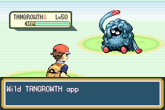
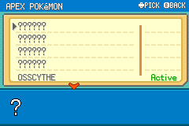

# Apex Pokemon

The Apex Pokemon are Kanto's answer to a question Oak is obsessed with:

How do Pokemon change when no trainer is guiding them?

They are not simply legendaries. They are extreme cases of adaptation, emotion, isolation, myth, power, grief, and survival.

*An Apex Tangrowth encounter begins. Archived playthrough capture.*

## Why "Apex"?

At first, these encounters were treated like legendary Pokemon. But that word carried the wrong expectations. Legendary implies mythic rarity. Apex implies a Pokemon pushed to the top of its local pressure system.

That fits the mod better.

An Apex Pokemon is not just rare. It is a living answer to an environmental or emotional condition.

## The Apex Themes

Each Apex mirrors a gym leader theme:

- Articuno: sudden change, mirrored by Misty's beauty of change.
- Mime Sr: isolated community, mirrored by Koga's strength in community.
- Osscythe: family loss, mirrored by Erika's love for family.
- Tangrowth: mysticism and urban legend, mirrored by Brock's ancient fascination.
- Annihilape: uncontrolled emotion, mirrored by Sabrina's emotional peace.
- Moltres: natural renewal, mirrored by Blaine's innovation and progress.
- Zapdos: infinite natural power, mirrored by Surge's training for power.
- Mewtwo: absolute power without trust, mirrored by Giovanni's arc.

## How Encounters Work

Apex encounters use their own structure:

- The player hears three rumours.
- The Apex becomes visible in the world.
- The encounter uses an Apex battle setup.
- Oak sends a field message afterward.
- The Logbook records progress.

They also use screen shake, unique roar text, and overworld presence to make the encounter feel like a discovery rather than just another wild battle.

## What Changed Under The Hood

- Legendary encounter logic was split into Apex-specific behavior.
- Apex Pokemon use event-mon setup where appropriate.
- Rumours update counters and visibility.
- Apex subquests can reveal the target before it is found.
- Apex overworlds use bespoke sprites and palettes.

## Encounter identity extends into the battle

Custom species need more than a silhouette and a dramatic introduction. Mime Sr and Osscythe have dedicated stat and ability work, while Osscythe's Ground/Ghost typing carries its connection to Marowak and loss into combat. Their intended roles should be legible through appearance, moves and mechanics together.

Collection rewards acknowledge the extra investigation: Apex pages award two Exp. Candy L and one Rare Candy. That reward comes from completing the page, rather than merely hearing a rumour. It connects the investigation to the wider fieldwork loop without making the reward the whole reason to seek an Apex.

There is an important development distinction here. Encounter progression and the custom ability implementation have evidence behind them, but the dedicated live custom-ability battle pass remains deferred. The devlog should not describe those abilities as fully balance-tested. The [release QA record](../release-playthrough/october3/README.md) makes that boundary explicit.

## Screenshots And References

*The Apex log hides undiscovered entries and records active leads.*

## Screenshot And Art Checklist

Checked items are illustrated above. Unchecked items still need a matching capture or historical source.

- [ ] Apex Pokemon appearing after rumours.
- [ ] Apex Log with silhouettes.
- [ ] Oak post-encounter message.
- [x] An Apex battle start.
- [ ] Apex overworld sprite sheet comparison.

## Closing Thought

Apex Pokemon are not just bosses. They are the wild half of the game's thesis: Pokemon evolve with people, but they also evolve against the world.
