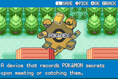
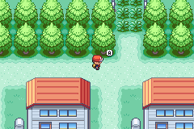

# The New Start Menu

The old FireRed start menu is practical, but it feels like a list.

Pokemon Expeditions needed something closer to a field aide toolkit.

So the start menu became radial.

## The Shape

The radial menu opens around the player, with icons for:

- Pokedex
- Pokemon
- Bag
- Card
- Map
- Settings
- Help
- Logbook

The selected icon bobs, the backdrop scales in, and the center label updates with the current entry.

*The radial menu with POKéDEX selected.*

## Why Radial?

A radial menu makes the player's tools feel physical and immediate. It also helps the mod's identity: this is not just FireRed with more options. This is a field aide interface.

The menu now acts as a hub for the systems the mod cares about most.

## The Visual Pass

The radial menu went through a lot of tuning:

- Icon positions were adjusted pixel by pixel.
- Save and Settings labels moved into the shared header language.
- The center label was refined to avoid tile glitches.
- The backdrop was recolored to fit the UI.
- Icons were packed into a shared sheet.
- Palette tags were moved away from weather sprite tags.

## The Control Pass

Navigation was cleaned up so directions feel intentional.

Examples:

- Each tool has a stable position around the player.
- The centre label identifies the selected destination.
- The D-pad glyph changes based on available directions.

## Current Build Notes

The radial menu now has eight entries: Pokedex, Pokemon, Bag, Card, Map, Settings, Help, and Logbook.

The icons are packed into one sheet with a shared palette, and the directional glyph changes depending on which neighbouring entries are available. `L SAVE` now lives in the common themed header instead of being a separate floating label.

The menu still opens with its backdrop scaling into place, then the icons appear once the backdrop has settled. The save overwrite warning has also been removed so saving feels less fussy.

## Appearance and controls belong to the same system

The interface now supports blue, rose and green themes. The player's second clothing accent selects the matching UI frame, and radial icons shift into the corresponding palette. The primary clothing accent remains independently selectable. Choosing a style and two colours happens together, so personalisation does not become a long sequence of small questions.

The radial menu is only the entrance to the toolkit. Its value depends on what happens after a tool opens: a consistent back action, a visible selection hint and a stable place to look for controls. A menu that is memorable to open but unpredictable to use would miss the point.

The detailed navigation rules, including edge-aware D-pad dots and the distinction between wrapping lists and bounded pages, are covered in [the shared UX post](10-making-menus-feel-like-one-game.md).

## Screenshots And References

*First steps out of Pallet Town.*

## Screenshot And Art Checklist

Checked items are illustrated above. Unchecked items still need a matching capture or historical source.

- [x] Closed overworld before opening menu.
- [x] Radial menu open with Pokedex selected.
- [ ] Icon sheet.
- [ ] D-pad glyph variants.
- [ ] Menu opening animation.

## Closing Thought

The start menu is one of the first things players touch over and over. Making it feel like this mod's menu, not just FireRed's menu, was worth the tiny pixel fights.
