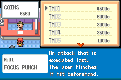
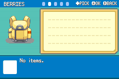
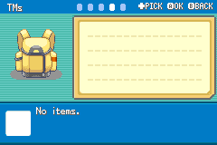
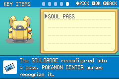

# Rebuilding The Bag

The bag had to carry more of the mod's structure.

FireRed's original pockets were not enough once berries, TMs, key items, and field tools started changing roles.

## The New Pockets

The bag now uses:

- Items
- Berries
- Poke Balls
- TMs
- Key Items

This makes the bag feel closer to a modern item system while still fitting the GBA UI.

*The Items pocket with its page notches and description panel.*

## The Visual Problem

Adding pockets is not just a data change. The bag screen is tile-based, so every extra pocket affects the layout:

- Header hints needed room.
- The pocket name moved to the shared header.
- The bag graphic and shadow needed repositioning.
- The list window had to become rectangular.
- The old left and right arrows became unnecessary.
- Pocket notches were rebuilt to match the Pokemon summary style.

## Berries

Berries needed real use cases.

Some vanilla berry effects were leftovers from systems that no longer made sense. The mod updates berries with modern-style behavior where possible, including EV-lowering berries and clearer use messages.

## TMs

TMs moved into their own pocket, which revealed issues around teaching moves, list routing, and party-menu transitions.

This was one of those "the feature works until you actually press A" problems.

## Current Build Notes

The bag now uses five pockets: Items, Berries, Poke Balls, TMs, and Key Items.

The old CANCEL list rows have been removed because the common hint header now teaches `B BACK`. The pocket name and page notches live in that header, matching the Pokemon summary screen's page language.

Berries now have modernised effects where FireRed only had placeholder or powder-machine behaviour, and berry use in battle has been repaired. Fossils correctly show quantities, coins no longer require the Coin Case, and the Bike Voucher has been removed now that bicycles can be bought or rented.

## Rewards should make the bag easier to use

Exp. Candies now have distinct item icons with dark outlines that suit the other inventory art. Page rewards deliver S, M or L candies according to the page's difficulty, alongside a Rare Candy; habitat completion supplies an XL candy. The reward loop therefore gives this pocket a clear role in helping the next team member catch up.

The bag also needs to tell the truth about its edges. The first pocket does not advertise a leftward move, and the last does not advertise a rightward move. Extra arrow art and redundant CANCEL rows are removed because the header already explains navigation and B BACK.

The shared colour theme reaches the footer and pocket notches as well as the header. Leaving one of those elements in its old blue would make the rose or green version feel unfinished. These are small details, but players see them every time they check an item.

## Screenshots And References

*The Rocket TM counter uses a browsing shop with prices and balance in coins. Controlled shop fixture from October 2.*

*The Berries pocket; this capture save has no berries.*

*The TM pocket; this capture save has no TMs.*

*The Key Items pocket showing the Soul Pass.*

## Screenshot And Art Checklist

Checked items are illustrated above. Unchecked items still need a matching capture or historical source.

- [x] Bag pocket overview.
- [x] Berry pocket.
- [x] TM pocket.
- [x] Header hint strip.
- [ ] Before and after bag layout.

## Closing Thought

The bag is one of the least glamorous systems to rebuild, but it is also one of the most important. If the bag feels wrong, the whole game feels rough.
