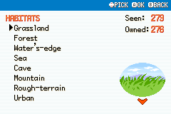
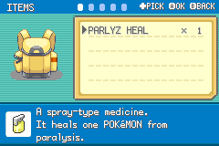
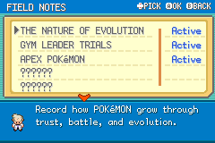
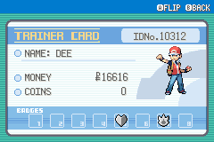
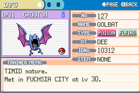
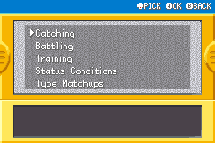

# Making Menus Feel Like One Game

Once the mod had a radial start menu, the next problem was obvious:

Every menu it opened needed to feel like part of the same device language.

## The Shared Header

The Bag, Pokedex, Pokemon, Card, Logbook, and Help menus now share a common hint-header idea.

Depending on the screen, it can show:

- The current page title.
- Notches for page groups.
- `+ PICK`
- `A OK`
- `A FLIP`
- `B BACK`

*The Pokédex habitat list and shared blue control header.*

## Why Hints Matter

FireRed often expects the player to know what buttons do. That works, but once the mod adds new menus and repurposed systems, button behavior needs to be clearer.

The header makes those controls visible without adding tutorial text everywhere.

## Menu-Specific Changes

- Bag: pocket names moved to the header.
- Pokedex: footer hints moved upward into the header.
- Pokemon: the old choose/cancel boxes were removed.
- Trainer Card: A flips the card, B exits.
- Logbook: title moved into the shared header, and non-selectable entries hide `A OK`.
- Help: the Teachy TV replacement uses the same hint logic.

## The Tile Work

Most of this was not "draw a UI once." It was tile surgery:

- Moving tile rows.
- Replacing corner tiles.
- Fixing palette slots.
- Removing unused duplicate tiles.
- Avoiding transparent colours.
- Making the same visual idea work across very different screens.

## Current Build Notes

The shared menu language now covers Bag, Pokedex, Pokemon, Trainer Card, Logbook, and Help.

Paged menus use a blue hint header with the screen label, notches, and compact controls such as `A OK`, `A FLIP`, `B BACK`, or `+ PICK` depending on the screen. Non-selectable Logbook entries hide `A OK` so the header does not promise an action that is not there.

The Trainer Card now flips with `A` and exits with `B`, while the header stays fixed instead of flipping with the card. The Pokemon summary uses shorter page labels: INFO, STATS, and MOVESET.

## Screenshots And References

*The Items pocket with its page notches and description panel.*

*The field-notes index connects the research storylines.*

*The Trainer Card uses the same top-edge control hints.*

*The Pokémon summary INFO page keeps its page and back controls in the blue header.*

*The Help topic list uses the shared blue selection and back-control header.*

## Screenshot And Art Checklist

Checked items are illustrated above. Unchecked items still need a matching capture or historical source.

- [x] Bag header.
- [x] Pokedex header.
- [x] Pokemon summary header.
- [x] Trainer Card header.
- [x] Logbook header.
- [x] Help header.

## Closing Thought

Menus are invisible when they work. That is the point. The more these screens share a language, the more the player can focus on the journey instead of the controls.
