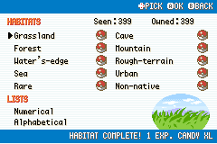
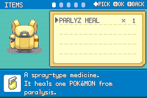
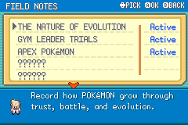
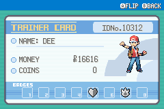
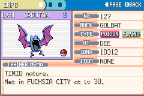
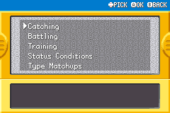

# Making Menus Feel Like One Game

Once the mod had a radial start menu, the next problem was obvious:

Every menu it opened needed to feel like part of the same device language.

## The Shared Header

The Bag, Pokedex, Pokemon, Card, Logbook, and Help menus now share a common hint-header idea.

Depending on the screen, it can show:

- The current page title.
- Notches for page groups.
- `+ PICK`
- `A OK`
- `A FLIP`
- `B BACK`

*Earlier Pokédex habitat layout and shared blue control header; the current index uses two columns.*

## Why Hints Matter

FireRed often expects the player to know what buttons do. That works, but once the mod adds new menus and repurposed systems, button behavior needs to be clearer.

The header makes those controls visible without adding tutorial text everywhere.

## Menu-Specific Changes

- Bag: pocket names moved to the header.
- Pokedex: footer hints moved upward into the header.
- Pokemon: the old choose/cancel boxes were removed.
- Field Aide card: A flips the card, B exits.
- Logbook: title moved into the shared header, and non-selectable entries hide `A OK`.
- Help: the Teachy TV replacement uses the same hint logic.

## The Tile Work

Most of this was not "draw a UI once." It was tile surgery:

- Moving tile rows.
- Replacing corner tiles.
- Fixing palette slots.
- Removing unused duplicate tiles.
- Avoiding transparent colours.
- Making the same visual idea work across very different screens.

## Current Build Notes

The shared menu language now covers Bag, Pokedex, Pokemon, Trainer Card, Logbook, and Help.

Paged menus use a themed hint header with the screen label, notches, and compact controls such as `A OK`, `A FLIP`, `B BACK`, or `+ PICK` depending on the screen. Non-selectable Logbook entries hide `A OK` so the header does not promise an action that is not there.

The Field Aide card now flips with `A` and exits with `B`, while the header stays fixed instead of flipping with the card. The Pokemon summary uses shorter page labels: INFO, STATS, and MOVESET.

## A direction indicator is a promise

The red dots on the D-pad glyph show which directions currently do something. They are part of the control specification, not decoration.

| Screen | Behaviour the header needs to explain |
| --- | --- |
| Habitat pages | Left/right move between available pages; neither end exits the habitat. |
| Dex entry | A alternates between the description and area/size view; B leaves either view. |
| Habitat index | Two columns reduce scrolling; moving up from Grassland wraps to Type under Lists. |
| Party | The active Pokémon leads right into the reserves; the reserve list wraps vertically. |
| Bag | Pocket movement stops at the first and last pockets. |
| Help and Logbook | Left/right do nothing in their lists. |
| Settings | B BACK remains in the header; the duplicate CANCEL row and title box are removed. |

This is not a rule that every list must wrap. Wrapping helps a vertical list, whereas leaving a habitat because the player pressed past its final page is an accidental exit. Consistency means that visible hints and actual input agree.

## Colour, boundaries and feedback

Blue, rose and green are shared themes, derived from the player's secondary accent. Headers, footers, page notches, dialogue frames and radial icons have been brought into that system. The header's final pixel row should join the background cleanly, including the darker stripe on the Field Aide card.

Pokédex rewards use a separate feedback pattern: the header pulses when a claim is available, START CLAIM replaces A OK, and a temporary footer presents the reward. The page avoids a second large notification window. Earlier overlay experiments corrupted the display; the quieter receipt also leaves the collection context visible.

## Screenshots And References

*The habitat claim displays its one EXP. CANDY XL reward in the footer. Controlled full-Dex fixture used to check the reward interface, not a naturally completed collection.*

*The Items pocket with its page notches and description panel.*

*The field-notes index connects the research storylines.*

*The Trainer Card uses the same top-edge control hints.*

*The Pokémon summary INFO page keeps its page and back controls in the blue header.*

*The Help topic list uses the shared blue selection and back-control header.*

## Screenshot And Art Checklist

Checked items are illustrated above. Unchecked items still need a matching capture or historical source.

- [x] Bag header.
- [x] Pokedex header.
- [x] Pokemon summary header.
- [x] Trainer Card header.
- [x] Logbook header.
- [x] Help header.

## Closing Thought

Menus are invisible when they work. That is the point. The more these screens share a language, the more the player can focus on the journey instead of the controls.
