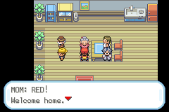
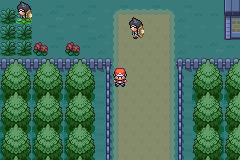
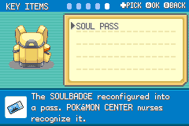

# Cleaning Up FireRed

*Returning home to a healing-house welcome. Archived playthrough capture.*

ROM hacking is not only adding things.

Sometimes the biggest improvement is removing systems that no longer serve the game.

## Why Remove Content?

FireRed has a lot of inherited systems:

- Sevii Islands.
- Mini-games.
- Mystery Gift.
- Tea blockades.
- Key items that exist for one old interaction.
- NPCs and scripts tied to removed flow.

Pokemon Expeditions is not trying to be "FireRed plus everything." It is trying to be a focused Kanto fieldwork game.

That means some things had to go.

## Major Cleanup Areas

Removed or repurposed:

- Sevii travel and related maps.
- Navel Rock and old event islands.
- Pokemon Jump.
- Dodrio Berry Picking.
- Berry Crush.
- Mystery Gift.
- Tea gate blockers.
- Fame Checker as an item.
- Teachy TV as an item.
- Coin Case requirement.
- Unused gym trainer scripts.

## Making The World Cleaner

Some removals also made navigation cleaner:

- Gatehouses that only served blockers were removed.
- Saffron can be entered naturally after cleanup.
- Lavender's Pokemon Center was repurposed into a healing house.
- Route 2 forest gates were removed in favor of direct access.

## The Hard Part

Deleting content is easy.

Deleting content without breaking references is the real work.

Every removed system leaves behind possible:

- Items.
- Scripts.
- Flags.
- Text.
- Maps.
- Menu entries.
- Graphics.
- Build references.

The cleanup work is slow because the game remembers everything.

## Current Build Notes

Recent cleanup removed several systems that no longer fit Expeditions Kanto:

- Mystery Gift.
- Pokemon Jump.
- Dodrio Berry Picking.
- Berry Crush.
- Berry Fix.
- L/R Help System entry points.
- Teachy TV as an item and starter gift.
- Fame Checker as an item.
- Coin Case and Bike Voucher.

Some systems survived, but changed jobs. Teachy TV became the Help menu, Fame Checker became the Apex Log, and the old quest menu became the Logbook.

## Screenshots And References

*The open approach to Saffron City. Archived playthrough capture.*

*The Key Items pocket showing the Soul Pass.*

## Screenshot And Art Checklist

Checked items are illustrated above. Unchecked items still need a matching capture or historical source.

- [ ] Removed gatehouse comparison.
- [ ] Old item list versus new key item list.
- [ ] Lavender healing house.
- [x] Saffron entrance cleanup.
- [ ] Build cleanup diff snippet.

## Closing Thought

Good cleanup is not glamorous, but it makes the new design clearer. The less the old game gets in the way, the more Expeditions can be itself.
