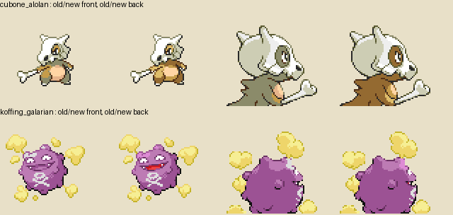
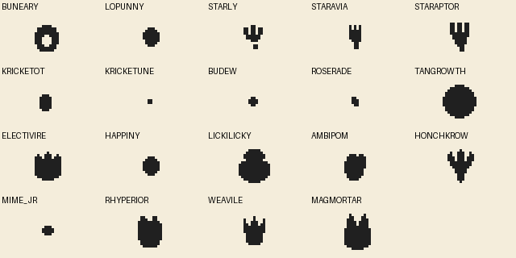
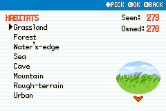

# Pokemon Art And Palette Pass

*Before/after colour-role corrections for regional Cubone and Koffing, front and back.*

Adding new Pokemon art is not just dropping in sprites.

The real question is:

Does it feel like it belongs in FireRed?

## The Palette Problem

A sprite can be well drawn and still feel wrong if its colours are too saturated, too flat, or too modern.

That led to a wide palette pass across custom and expanded Pokemon.

Examples:

- Kricketot and Kricketune were warmed into earthier reds.
- Mismagius was softened using Misdreavus-like pinks.
- Weavile was toned down.
- Combee and Vespiquen were rebalanced after becoming too desaturated.
- Bronzor and Bronzong were adjusted to share a more vanilla-feeling palette.

[Sprite sheet: before and after palette examples]

## Shared Family Palettes

Where possible, evolution lines were made to share palettes:

- Buneary and Lopunny.
- Aipom and Ambipom.
- Starly, Staravia, and Staraptor.
- Sentret and Furret.
- Electivire line.
- Lickitung and Lickilicky.
- Bronzor and Bronzong.

This saves space and makes family identity clearer.

## Menu Icons

Menu icons were added or corrected for many Pokemon:

- Annihilape
- Ambipom
- Budew
- Combee
- Electivire
- Honchkrow
- Kricketot
- Kricketune
- Lickilicky
- Lopunny
- Magmortar
- Magnezone
- Mime Jr
- Mime Sr
- Mismagius
- Rhyperior
- Starly line
- Tangrowth
- Vespiquen
- Weavile

## Footprints

Footprints needed their own pass too. Some were missing, copied from earlier forms, or sliced incorrectly.

Ambipom and Lopunny received official-style footprints, and the footprint rendering issues were debugged until they displayed correctly in-game.

## Current Build Notes

The art pass has moved from adding sprites to making the Pokedex feel palette-coherent. Several evolution lines now share palettes where it makes sense, including Buneary/Lopunny, Aipom/Ambipom, Starly/Staravia/Staraptor, Kricketot/Kricketune, Bronzor/Bronzong, Sentret/Furret, and parts of the Electabuzz, Magneton, and Lickitung lines.

Menu icons and footprints were filled in for newer species, while custom palettes were softened toward FireRed-style colours when they felt too saturated or too flat.

## Colour can explain ancestry

The fossil family makes palette consistency part of the fiction. Shell colours connect related reconstructions, the blue bodies connect to Amunyte, and cream body parts connect to Kinkabuto. A player should be able to compare them and infer which physical pieces belong together. The [fossil design post](17-fossils-as-incomplete-reconstructions.md) explains the fragment combinations.

Aeropteryx's pass illustrates a different problem. Too little contrast flattened the body; very deep purple shadows overwhelmed it. The revisions worked toward readable grey volume, a wing palette related to Aerodactyl and a tongue that stays distinct from the wings. Its current typing is Dragon/Flying.

The supporting assets matter too. The footprint audit now covers all 399 active species, including eleven custom footprint designs. Imported cries and altered family-based cries give the expanded roster an audio identity. These additions do not mean the battle art is finished: Deep Feebas and several custom backs remain on the final art list.

## Screenshots And References

*The footprint correction reference sheet.*

*Earlier Pokédex habitat layout and shared blue control header; the current index uses two columns.*

## Screenshot And Art Checklist

Checked items are illustrated above. Unchecked items still need a matching capture or historical source.

- [x] Palette comparison grid.
- [ ] Menu icon sheet.
- [x] Footprint preview.
- [x] Front and back sprite examples.
- [x] In-game Pokedex view.

## Closing Thought

The best custom sprite work is the kind players stop noticing. If it feels like it was always in FireRed, it worked.
