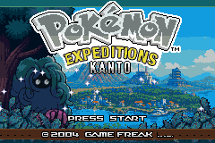
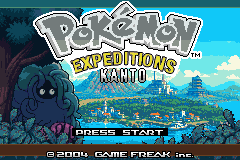

# Start Screen Makeover

The title screen is the first promise the game makes.

FireRed's Charizard screen is iconic, but Pokemon Expeditions needed a different mood:

Fieldwork. Mystery. Kanto seen from a new angle.

## Tangrowth Replaces Charizard

Tangrowth became the title screen Pokemon because it captures the mod's tone:

- Ancient forest energy.
- Mystery.
- Overgrowth.
- Something familiar but slightly strange.

*Tangrowth overlooking Kanto on the September title-screen build.*

## The New Scene

The start screen grew into a layered composition:

- A panoramic Kanto backdrop.
- Tangrowth in the foreground.
- Leafy grass and a tree layer.
- Sparkles replacing the old flame animation.
- A darker green header.
- A brown footer with lighter border lines.
- A night transition after idling.

## Sparkles Instead Of Flames

The flame animation no longer fit the theme.

It was replaced with sparkles inspired by the Game Freak splash screen. They drift upward, change size, and fade out, giving the screen a softer magical quality.

## Day And Night Mood

The start screen now transitions toward a darker, slightly purple-blue night tone while idle, then back again.

It is not tied to real in-game time yet, but it sells the idea that this title screen is a place, not just a logo.

## The Tilemap Battle

This screen was a tilemap puzzle:

- Tangrowth needed new offsets.
- Footer text had to move cleanly.
- The grass layer could not corrupt Press Start.
- The backdrop needed palette-safe tiles.
- Several visual artifacts came from tile and palette overlap.

## The final small details are part of the promise

Pressing Start now plays Tangrowth's cry. The title strip reads MOD BY DEE KARIYAWASAM - 2026, using a thin brown band with grass visible beneath it. Cleaning up its stray dark pixels and separating its tiles from the blinking prompt keeps the attribution readable through the animation.

The earlier copyright splash retains the original credits and dates, with a separate Expeditions Kanto · 2026 mod line. That presents the project's identity without relabelling the original game's creation date. The archived title screenshots in this post predate this final wording and strip adjustment.

The same approach applies to the ending credits: identify the new work clearly, retain the original contribution, and track imported art carefully. Unresolved artist attribution remains an open task; a credit should describe a contribution that can actually be supported.

## Screenshots And References

*An earlier title-screen development preview.*

## Screenshot And Art Checklist

Checked items are illustrated above. Unchecked items still need a matching capture or historical source.

- [ ] Original FireRed title screen.
- [ ] Early Tangrowth mockup.
- [ ] Grass and tree asset.
- [ ] Day version.
- [ ] Night version.
- [ ] Sparkle animation stills.

## Closing Thought

Changing the title screen made the mod feel real. Before the player presses Start, the game already says: this is a different Kanto.
