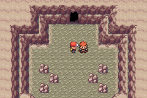

# What I Learned Hacking FireRed

*Before/after colour-role corrections for regional Cubone and Koffing, front and back.*

This project has been a long chain of small discoveries.

Some were design discoveries. Some were technical. Some were just learning that one tile being wrong can ruin your entire afternoon.

## Palettes Are Everything

A lot of bugs that looked like broken graphics were actually palette problems:

- Sprites inheriting weather palettes.
- Transparent colours becoming opaque.
- Bridge tiles using the wrong palette from neighboring maps.
- Menu icons fighting over limited palette slots.
- Field effects turning black after a flashback.

On the GBA, colour is not just colour. It is state.

## Tilemaps Are Ruthless

A graphic can be perfect in a PNG and still be wrong in-game.

The title screen, bag menu, logbook, bridge connections, and trainer card all had moments where the art was fine but the tiles were not.

That taught the real rule:

The asset is only half the image. The tilemap is the other half.

## Scripts Need Rhythm

Cutscenes live or die on tiny timing details.

An exclamation mark needs a pause. A rival turn needs a delay. Giovanni needs to wait before walking. A flashback needs the white fade to cover the repositioning completely.

The scripting is not just logic. It is performance.

## Reuse Is Harder Than It Sounds

The Route 7 flashbacks forced a cleanup of reusable helpers:

- White transition helpers.
- Greyscale setup and teardown.
- Flashback object positioning.
- Music speed changes.
- Field effect cleanup.
- Cutscene recovery.

The first working version is rarely the clean version.

## Design Keeps Pulling Code Into Shape

Most technical changes came from a design need:

- The radial menu needed icon packing.
- Apex rumours needed counters and live object refresh.
- Bike rental needed guard-house routing.
- Giovanni's story needed new flags and quest state.
- The bag needed new pockets.
- The Pokedex needed cleaner habitat presentation.

Good design pressure is useful. It tells the code what it wants to become.

## A useful tool makes the wrong assumption visible

The debug dashboard grew from a way to inspect emulator state into a way to see the region. A connection diagram answers which maps link together. A tile-level world view answers whether those links look physically plausible. Seeing the actual maps joined exposed gaps, overlaps and coastline problems that were harder to notice while walking one screen at a time.

That distinction applies to testing too. A reward fixture can establish that one XL candy is granted and a repeat claim is rejected. It cannot establish that earning a whole habitat through ordinary play feels well paced. A collision audit can identify invalid events; it cannot prove every shoreline feels right.

The current QA records distinguish earned playthroughs, controlled fixtures, source checks and deferred work. The Pallet/Route 21 issue is a useful recent example: static checks passed, but a player still reported corruption. The latest changes share physical graphics across the boundary and protect empty border cells, while the record openly says the exact reported failure was not reproduced in the clean-load fixture.

That honesty is useful design information. See [the development dashboard post](20-seeing-and-testing-the-whole-region.md) for the workflow and its limits.

## Screenshots And References

*The radial menu with POKéDEX selected.*

*Lance at the Celadon Cave scene. Archived playthrough capture; not the beam animation.*

## Screenshot And Art Checklist

Checked items are illustrated above. Unchecked items still need a matching capture or historical source.

- [ ] Before and after screenshots from several systems.
- [ ] A funny broken tile/palette screenshot.
- [x] A clean final UI screenshot.
- [ ] A cutscene frame.
- [x] A sprite sheet before and after.

## Closing Thought

ROM hacking FireRed is a conversation with constraints. Sometimes the game says no. Sometimes it says yes, but only if you move everything one pixel down.

That is part of the charm.
