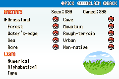

# Making Every Catch Matter

The collection problem was easy to describe. If an entire evolution line is available in the wild, and its final form is higher level, why catch the earlier stages?

The answer chosen for Expeditions Kanto is to make the Pokédex page a meaningful unit of fieldwork. Catching the strongest member helps the team. Completing the page records the wider group and earns a separate reward. This lets the game encourage collection without removing every convenient evolved encounter.

## Small goals inside a large collection

A full regional collection is a distant target. A page offers a smaller, visible task, while a habitat groups those tasks around a place and its ecology. The reward can then help train a newly caught Pokémon, feeding the next investigation rather than sitting in an unrelated score counter.

| Completion | Current reward |
| --- | --- |
| Easier page | 1 Exp. Candy S and 1 Rare Candy |
| Middle-tier page | 1 Exp. Candy M and 1 Rare Candy |
| Harder page, including friendship-evolution pages | 1 Exp. Candy L and 1 Rare Candy |
| Apex page | 2 Exp. Candy L and 1 Rare Candy |
| Habitat | 1 Exp. Candy XL |

These are current implementation choices, not a claim that the whole economy has finished its balance pass. In particular, naturally earning every reward still needs broader ordinary-team playthrough coverage.

## A claim that stays inside the Pokédex

Completing a page does not interrupt exploration with a new popup. On the page, the header offers START CLAIM in place of A OK and pulses to draw attention. While the reward is waiting, the page is dimmed and entry selection is suspended; left and right still move between the available pages. Claiming restores normal inspection.

The receipt appears in an animated footer, then retracts into the right edge. The Poké Ball remains visible above it, including when a completed page is ready to claim. Completed or claimable habitats also receive a ball beside their name in the two-column index.

*Controlled full-Dex fixture, not earned collection progress. The latest marker pass preserves a black outline instead of mapping its dark right side into brown.*

Earlier large notification-window experiments corrupted the page. Keeping the receipt in an existing UI region solved a presentation problem and reduced interruption at the same time. Bag-space checks and saved claim flags protect the practical side: an unsuccessful grant must not silently consume the reward, and returning to the page must not grant it twice.

## Completion must be possible

The October 3 roster has 399 active species, but the Field Aide collection star checks the 318 currently obtainable species. Those are different counts with different purposes. The star should not demand a non-native entry that has no acquisition route in this build.

See the [reward tests](../../tools/test_pokedex_page_rewards.py), [active roster](../active-pokedex-roster.md) and [recorded habitat claim](../release-playthrough/october3/README.md) for implementation and verification detail.
