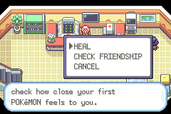
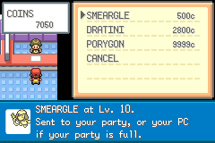

# Evolution Without a Second Console

An evolution can be an interesting research goal and still be frustrating if it depends on another console. Expeditions Kanto uses in-game trades to make several of those transformations part of the region itself.

*The Soul Pass opens a friendship-check service at the healing counter. Archived playthrough capture; the menu reflects that earlier build.*

The important part is the encounter around the transaction. Receiving a Machoke and watching it become Machamp teaches something different from simply finding Machamp in grass. Held-item trades give the item, the partner and the location a role in the discovery.

## Put the expertise somewhere believable

Trades involving Metal Coat, Protector and Magmarizer belong naturally with laboratory research. Their scientists describe human-made items as things developed there. Existing Gym Leader trades remain attached to their leaders, and Reaper Cloth is not treated as a laboratory invention just because it is an evolution item.

Other trades take their identity from the environment. The Seadra trade sits on a Route 20 sand patch among the region's dragon associations. Slowking's route runs through a beach trade on Route 19. Alolan Golem is obtained through a Safari Zone trade rather than directly as an East-area wild encounter.

The Huntail/Gorebyss pair adds a demonstration first: defeat the water-trainer duo using the evolved forms, then receive their trade offers. The player sees the result in action before deciding to pursue it.

## Porygon turns knowledge into an upgrade

Blaine's terminal builds on the original Porygon transaction. With Porygon holding Upgrade, a further three-question quiz can return it as Porygon2 through the trade presentation. A scientist provides Upgrade, while a Rocket scientist provides Dubious Disc.

Porygon2's next branch uses another three questions. With Dubious Disc, getting at least one answer wrong produces Porygon-Z. A Patch Disc branch is implemented for a future Porygon3 path when all answers are correct, but the item is not distributed and Porygon3 is excluded from the active roster. It is preparation for a future feature, not an obtainable reward in the current game.

That distinction is central to the design: an upgrade should feel like an intervention with a method and an outcome, not just another anonymous stone.

## A shop should behave like a shop

The Rocket League's two prize clerks now provide browsing screens using coins. The Pokémon selection is Porygon, Dratini and Smeargle. These choices give the counter a technological, unusual or collecting-oriented character, while avoiding another copy of locally common Houndour, Larvitar or Murkrow.

*October 2 controlled shop-validation capture. The transaction path was tested separately from an earned coin-grinding playthrough.*

The [October 2 evidence](../feature-validation-october2/coverage.json) covers sixteen NPC trades, terminal cases and shop behaviour. It is more specific than a blanket claim that every possible player state has been tested.
