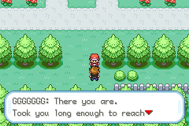

# A Rival Who Travels the Same Region

The rival should appear to have travelled through the same Kanto as the player. If the game asks the player to investigate evolution, but his team only follows the old FireRed roster, his journey misses the project's central idea.

*The rival encounter in Celadon reaches its opening dialogue. Controlled encounter fixture; the repeated-letter rival name belongs to the test save.*

His team is therefore a record of experiences. A friendship evolution suggests time spent caring for a partner. A human-made held-item trade points toward the laboratory. Kabuknight reflects fossil reconstruction. A stone evolution varies with the starter branch. His own Apex discovery sits outside the player's eight investigations, suggesting a region with more stories than the protagonist personally resolves.

## Identity survives a roster change

Nicknames help those Pokémon feel chosen by this rival. They are another way to express his personality, alongside what he says and which creatures he uses. Removing the inherited implication that one of his Pokémon died also keeps his development centred on this version of the story.

These changes need to hold across the starter branches and later encounters. The useful test is not simply whether the Champion has six valid species. It is whether the intermediate battles make that final team feel earned, and whether the dialogue still makes sense when a player explores in a different order.

## Other specialists need their own logic

Gym challenge variants are checked for duplicate evolution lines, so a scaled roster does not become a stack of related forms. Lance's Dragon identity, Agatha's roster and the Rocket administrators' specialisms are also part of making opponents legible.

The administrators' teams are designed to counter the Elite Four, with their own nicknames and tactical identities. They should give the Rocket League a point of view rather than merely repeat the Indigo opponents with higher levels.

## Two competitions, two rhythms

Indigo runs four double-battle rounds followed by the rival. Rocket runs four single-battle rounds followed by Giovanni. Doubles and singles ask different questions of the player's team, which gives both competitions a reason to exist in the same adventure.

Roster inspection and scripted encounter checks establish that these choices are wired into the game. They do not replace a representative balance playthrough with an ordinary team. The [current QA record](../release-playthrough/october3/README.md) keeps that work visible.
