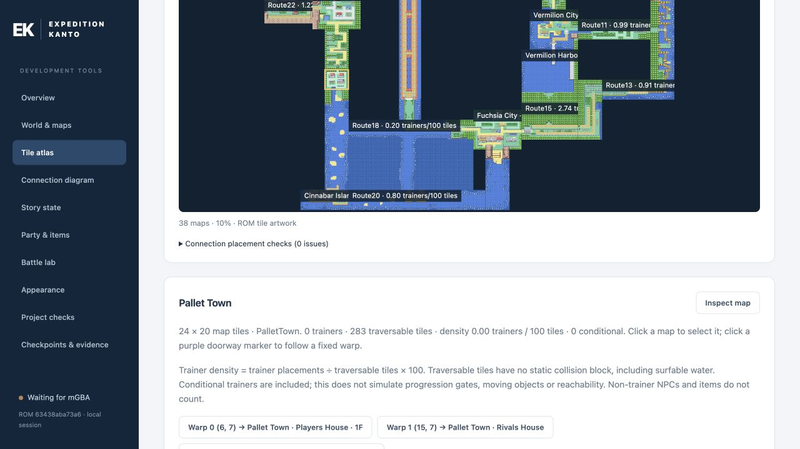

# Seeing and Testing the Whole Region

A map can look convincing on its own and still be wrong in Kanto. The dashboard's visual world view makes that distinction visible by joining maps using their actual tiles and connection offsets.

*The connected tile atlas exposes the southern coastline and trainer-density information. Fresh October 4 dashboard capture with no emulator attached; the map is a static rendering of ROM tiles.*

A separate connection diagram shows links and warps. The tile view shows the landscape those links produce. Both are useful: one explains reachability, the other exposes gaps, overlaps and mismatched approaches.

## Design decisions made visible

This view helped inspect Route 24/25, the Vermilion coastline, Route 18 and the merged Route 21, as well as the relationship between Viridian Channel, Route 16 and Celadon. The design constraint was often to preserve a familiar vanilla location while adjusting the new connecting terrain around it.

The map view also supports a more useful trainer-density measure. Trainers per traversable tile is closer to the player's encounter pressure than all NPCs divided by a rectangle containing mountains and unused margins. The current measure counts tiles without a static collision block, including surfable water; it does not simulate progression gates or moving obstacles. It is still a diagnostic, not a universal target: sight ranges, optional paths and battle difficulty can make equal numerical densities feel very different.

## Inspect, change, verify

The dashboard connects to mGBA and exposes the current map, party, story flags, variables and palette slots. It can drive controlled encounters and item checks, inspect the player's appearance and store evidence. A separate ROM/save copy keeps that test work away from the main campaign.

The static world rendering has limits. It does not include all runtime changes, NPCs, weather, animation or time-of-day tint. A clean-looking join in the tool must still be walked in the emulator. The recurring Pallet/Route 21 graphics issue is a direct example of why both views matter.

## Different evidence answers different questions

| Check | What it establishes |
| --- | --- |
| Source or data audit | A required definition, reference or invariant is present. |
| Controlled runtime fixture | A specific state produces the expected behaviour. |
| Earned playthrough | Progression can reach that state through normal play. |
| Ordinary-team balance pass | The challenge and reward pacing work together over time. |

For example, a full-Dex fixture demonstrates that a habitat claim grants one XL candy and cannot be repeated. It does not show how satisfying the habitat is to complete naturally. Keeping those records separate makes remaining work easier to prioritise.

The [dashboard guide](../../tools/debug_dashboard/README.md) documents the current tools, and the [release record](../release-playthrough/october3/README.md) describes which checks have actually been completed.
