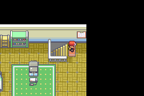
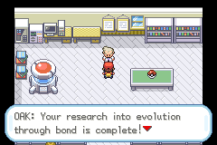
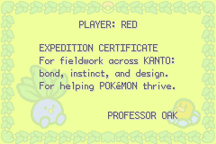

# Bringing the Expedition Home

Oak's expedition needs an ending that responds to what the player has learned. Winning the League is a major achievement, but the mod has also asked the player to study relationships, wild adaptation and deliberate intervention.

*The earned certificate appears on the bedroom wall, where the expedition can be remembered after its conclusion. October 3 campaign capture.*

*Oak acknowledges completed research into evolution through bond. Earned campaign capture from the October 3 playthrough.*

Oak now gives dedicated reactions to Evolution by Bond, Evolution by Instinct and Evolution by Design, followed by a response to the completed Nature of Evolution. Invitations bring the player back to the lab as those threads finish. The old extra five-Poké-Ball gifts no longer stand in for that conversation.

## The certificate belongs at home

The final expedition award follows its own prerequisites, including persistent League completion, Giovanni's progression, the Apex investigations, Gym trial progress and the relevant story encounters. It is not simply granted for opening the Pokédex or collecting one set of badges.

*October 3 earned-playthrough capture. This sequence used a separate campaign save, rather than injected completion flags.*

Before the award, the certificate is absent from the bedroom wall. Afterwards, the wall tile appears and interacting with it opens the certificate again. This makes the ending part of the player's familiar space instead of a one-time screen they can never revisit.

The final-gate fix also matters here. Hall of Fame clears a temporary Champion flag, so the expedition ending now checks persistent game completion. Returning home after a legitimate victory should not make Oak forget it.

## Three stars with clear meanings

The Field Aide card recognises three achievements: an Indigo Hall of Fame debut, catching the currently obtainable roster, and a Rocket League championship. The redundant old National Dex star has been removed.

The collection requirement deliberately differs from the active Pokédex display. At the October 3 audit, it uses 318 obtainable species rather than asking for all 399 active entries. Completion criteria should describe a task this version actually lets the player finish.

## What is still in development

The expedition ending and certificate replay have an earned playthrough record. That does not make the whole project release-complete. Remaining work includes custom battle art, naturally earned collection pacing, ordinary-party balance, deferred live ability tests, unresolved imported-art attribution and final patch packaging.

Patch Disc distribution/Porygon3 and extra ferry destinations are intentionally held back. Keeping those ideas visible without presenting them as available features makes the devlog a more useful account of the game players can actually test.

See the [earned ending and QA record](../release-playthrough/october3/README.md) for screenshots, prerequisites and the current release checklist.
