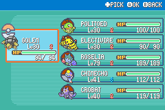

# Leader trade and friendship evolution checks

Completed 2026-09-14 on the disposable mGBA campaign fixture. All six native evolution sequences completed.

| Leader | Native result | Verified |
|---|---|---|
| Brock | Relicanth exchanged for Graveler → Golem | Trade and follow-up; completion flag |
| Misty | Gyarados exchanged for Poliwhirl → Politoed | King's Rock consumed; completion flag |
| Surge | Raichu exchanged for Electabuzz → Electivire | Electirizer consumed; SURGE original trainer; completion flag |
| Erika | Gift Budew → Roselia | Gift friendship 200; nighttime restriction; daytime evolution; return completes lesson |
| Sabrina | Gift Chingling → Chimecho | Gift friendship 200; no evolution at friendship 220/day; next nighttime level-up evolves |
| Koga | Gift Golbat → Crobat | Gift friendship 200; evolution at 220; return completes lesson |

The gifts arrived at level 30. Friendship was raised through native Rare Candy use, not by writing a happiness value. Chingling completed its daytime level-up to 40 at friendship 220 without evolving, then evolved at level 41/night. Golbat evolved at level 40 with friendship 220. Budew's accelerated nighttime candy loop continued to high friendship (255); it remained Budew until the daytime evolution check. Its final level of 79 reflects that diagnostic loop, not an evolution requirement.

The test deliberately replaced the disposable party, supplied trade species/candies, restored leader reward states, warped between gyms, and controlled the game's day/night variable. Trade exchanges, gift scripts, item use, friendship gains, evolution scenes, Pokédex registration, and return dialogue ran through the game. The main save was never used or overwritten. This is not a normal-level difficulty playthrough. PC delivery and full-storage failure branches were inspected but not replayed in this pass.

The six final Pokémon have valid checksums. Both held evolution items are gone. All three trade and gift flags are set. Erika and Koga finish at trial state 6; returning to Sabrina produces post-reward dialogue. Native wrong-species rejection was also observed at Surge. See `party-checks.txt`, `runtime-results.json`, and `dialogue-log.tsv`.

## Fixes included in the main ROM

- Surge's Electabuzz original-trainer name changed from CLIFTON to SURGE.
- Surge's post-trade dialogue now acknowledges Electivire and the completed evolution.
- Erika and Koga explicitly explain that friendship evolution requires a level-up; Erika specifies daytime.
- Erika's legacy post-lesson line about rejecting unattractive Pokémon now reinforces care and companionship.

Live evolution testing used the build containing the SURGE original-trainer fix. Subsequent dialogue-only edits were rebuilt and checked against the actual font widths.

## Validation

- `python3 docs/leader-evolution-checks/test_evolution_rules.py`: 260 assertions against the production C evolution selector and the six production evolution-table entries, including friendship 200–220, both times of day, Everstones, required trade items, and item consumption. The test uses an enabled National Pokédex, matching the game's initial Oak handoff.
- `python3 docs/leader-evolution-checks/verify_wording.py`: changed dialogue fits the 208-pixel text area.
- `make -j4`: successful main-ROM build.
- Protected main save SHA-256: `816eb072055dad4bbd8ca2b4d596cf468e58b68384664931a91e814dbb824b08`.
- Protected customisation ROM SHA-256: `880e9e2dc73c16084b10dfc3cb13bfa1b3535b637277e02a576fb8aee0194d5b`.
