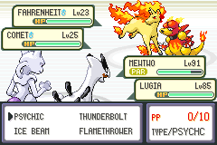
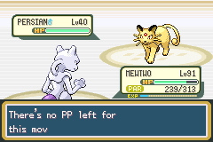
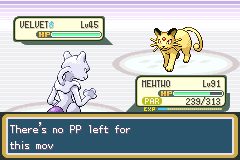

# Gym Leader Pokémon nicknames

Implemented uppercase nicknames for all seven scalable Gym Leaders (seven tiers each), Giovanni's Gym team, and Giovanni's Rocket League Champion team. The Indigo League reuses leader trainer IDs and therefore receives the same names. Earlier evolutionary stages use the corresponding partner name.

**Giovanni's Silph Co. team is deliberately excluded.** Persian, Kangaskhan, Nidoqueen, Nidoking, Gyarados and Rhydon keep species names in that encounter. Other trainers and wild Pokémon also retain their existing naming behaviour. Existing player Pokémon, gifts and in-game trades are not renamed by this battle-party lookup.

Names are applied after ordinary trainer Pokémon creation in `src/battle_main.c`, using the explicit trainer-ID/species lookup in `src/trainer_nicknames.c`. They do not enter personality generation or alter species, moves, levels, items, IV settings or friendship values.

## Naming details

The approved names are uppercase throughout. HONEYSUCKLE would exceed the ten-character limit, so Bellsprout/Weepinbell/Victreebel use **HONEY**. FAHRENHEIT fits exactly.

Separate partners in the same evolutionary family have distinct names:
- Surge's second-tier Pichu is CADET alongside Pikachu SPARKY. His first-tier Pichu is SPARKY.
- Surge's two sixth-tier Electabuzz are SARGE and MAJOR; the latter name belongs to Electivire in the seventh tier.
- Koga's sixth-tier Koffing is PUFF alongside Weezing HAZE.
- Sabrina's additional Abra is WISP, and her sixth-tier additional Kadabra is LUCID alongside Alakazam SAGE. Her original Abra/Kadabra/Alakazam retains SAGE.

## Verification

- `make -j4` passed.
- `python3 docs/leader-nicknames/verify.py` compiles the actual lookup on the host and checks all 51 named trainer parties: coverage, uppercase, ten-character limit, unique team names, selected continuity, and Silph/unrelated-trainer exclusions.
- Native battle setup in mGBA verified every nickname byte sequence for 208 Pokémon across those 51 parties, plus all six species names in Silph Giovanni's party: **214/214 passed**. See `runtime.tsv`.
- Health-bar screenshots confirm uppercase display, longest-name fit, and Persian's VELVET/PERSIAN distinction. These were staged battle entries, not complete fights or a campaign playthrough.
- All 658 compiled trainer party arrays were compared byte-for-byte against the prior palette-stress ROM using their respective ELF symbol addresses; unchanged.
- Palette recovery and Apex/terminal regression checks passed. The customisation ROM retains its protected hash. The historical Champion verifier reached its stale main-save hash assertion; its preceding compiled move checks passed. The user's main emulator was already open, and no write to the user's save was performed by this test.

The test used a disposable ROM/save and same-build savestate. Early harness logs are retained separately: they sampled skipped encounters from already-defeated trainer flags. The final run explicitly clears each tested trainer flag in the disposable state, starts the native encounter and checks the populated enemy party. `runtime.tsv` is the final result.

Some screenshot/test labels retain internal trainer-ID aliases such as BUG_CATCHER; these IDs are repurposed Gym Leader variants in this project. They are not the opponents' displayed classes.
