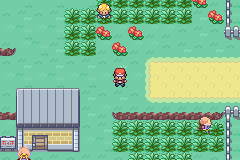
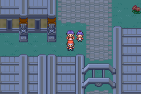
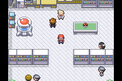
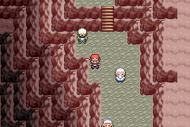

# Trainer overworld palette playthrough — 14 September 2026

**Result: one confirmed palette-allocation bug remains on Route 7.** The current main ROM was tested in mGBA using a disposable copy and save. No game code, artwork, main ROM, main save, or separate customisation ROM was changed during this pass.

## Confirmed failure

Enter Route 7 at (12,60), walk south to (12,70), return north to (12,60), and walk south again. Psychic M (graphics 202, palette tag `0x1140`) and Scout F (graphics 40, tag `0x1143`) receive fallback slot 2 rather than their own palettes. Both walks failed, and repeating the sequence in daylight failed again: eight incorrect object observations across four checkpoints.

At the southern checkpoint, dynamic slot 12 holds weather (`0x1200`), slot 14 holds Trendsetter M (`0x112c`), and slot 15 holds grass effects (`0x1005`). Slot 13 is free after earlier trainers disappear, but existing fallback sprites never retry allocation. The desired three trainer palettes plus weather and grass exceed the four dynamic slots. Reclaiming stale palettes alone therefore does not solve this case; a repair needs to address both capacity and recovery after allocation failure.

This reproduces the previously open issue from `docs/graphical-playthrough`; it is not a new regression introduced by the Champion movesets.

## Checked without a confirmed palette failure

| Locations | Main sprites checked |
| --- | --- |
| Oak's lab, before and after a native battle | Rival, Oak, Scientists, Channeler, worker |
| Route 3 and Viridian Forest | Youngster M/F, Scout, Breeder, Ranger and other nearby NPCs |
| Celadon, Celadon Gym, S.S. Anne room/deck | Trendsetter M/F, Aroma Ladies, Breeders, Sailors |
| Route 23 | Ace Trainer M/F together and separately |
| Fuchsia Gym | Janine, Koga, Ninjas |
| Saffron Gym/Dojo, Victory Road | Psychics, Black Belt M/F, Expert M/F |
| Route 9 | Hikers, Scouts and martial trainers; short repeated walking sequence |
| Route 16 | Bikers, Roughnecks, cyclists |
| Power Plant | Electricians and Scientists under the interior tint |
| Cinnabar Volcano | Kindlers and Expert M/F |
| Route 19 | Shore trainer, swimmers and tuber |
| Rocket League lobby | Rocket staff and nurse |

## Evidence and limits

- 46 valid overworld checkpoints on 20 maps, covering 54 distinct active graphics IDs and 241 active-object observations. This includes non-trainer NPCs and offscreen active objects; it does not mean 54 trainer classes were individually visually certified.
- Of those observations, 107 dynamic palette-tag checks passed, eight failed on Route 7, and 126 used fixed slots. `FIXED` is not an automatic RGB verification; fixed sprites were covered by screenshot review and the static wiring audit.
- `runtime-palettes-reviewed.tsv` excludes captures 28 and 33, which occurred during the volcano transition and cannot establish sprite corruption. Their raw records and screenshots remain for traceability. Settled capture 39 passed. Capture 37 is a black battle-entry frame, not a useful battle screenshot.
- The lab battle used the native Rival party (trainer 326) and normal battle engine/input, with the existing strong disposable test team. Outcome was a win (`1`); capture 38 and its palette readings verify return to the overworld. This checks palette restoration, not balance or opening-story progression.
- Most locations were reached through engine-script warps, with actual directional walking for the Route 7 and Route 9 sequences. Trainer sight encounters and random encounters were suppressed in test RAM. The Rival was revealed with the native add-object script; Koga's trial state was set to 4 in the disposable fixture to expose Janine. No such changes were saved to the user's save.
- First outdoor captures use the fixture's night lighting. Route 7 was explicitly repeated with `VAR_TIME_OF_DAY = TIME_DAY`. This is not exhaustive testing of weather, reflections, every animation, or every possible combination of visible NPCs.
- `tools/test_object_palette_lifetime.py` passed, including 200 reuse cycles. `tools/audit_overworld_palettes.py` passed all 181 sprite/palette pairs and map object lists. Those checks do not prove sufficient simultaneous runtime capacity.
- Main ROM SHA-256: `031aed301c3abd88d51f05b563b7127899ee3fe129a6871d2fd84960e7fe3429`. The tested copy matched the main ROM byte-for-byte afterward. Protected main save and customisation ROM hashes were unchanged.

The Route 7 bug remains unfixed at the end of this inspection. The next repair should target dynamic palette allocation and fallback recovery, preserving live field-effect palettes.

## Follow-up

The Channeler and Scout F were subsequently removed from Route 7. The [live retest](../route7-palette-retest/README.md) still found a fallback palette on the remaining Psychic after walking; allocation recovery remains unresolved.

Subsequent repair: [palette recovery](../palette-recovery/README.md) now passes the Route 7 day/night walking reproduction. Earlier failures above are historical.
