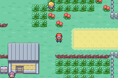
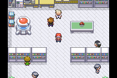

# Dynamic overworld palette recovery

The main ROM now retries loading a dynamic NPC palette when the sprite's assigned palette tag does not match its graphics. This runs during normal and quest-log movement updates, including frozen NPCs. Once a correct palette is assigned, the check does not reload it. Existing allocation, unused-palette cleanup and field tinting are reused; fixed palettes are untouched.

This repairs Route 7's remaining Psychic after the Channeler and Scout F removals: a palette slot becomes available when northern trainers despawn, and the Psychic now picks it up instead of remaining on fallback slot 2. It does not increase hardware capacity or guarantee correct colours while all slots are genuinely occupied.

Validation:
- `make -j4` passed.
- `tools/test_object_palette_recovery.py` exercises production recovery/loading/cleanup: full pool, later release, shared palette reuse, no repeated reload, fixed and field-effect protection.
- Existing lifetime test and 181-pair asset audit passed.
- Four north/south Route 7 checkpoints per lighting setting passed (eight total), including repeated walking through grass.
- Four Route 9 walking checkpoints and Oak's lab before/after a completed native trainer battle passed. Fourteen final checkpoints, no dynamic tag mismatches. Main save and customisation ROM hashes were unchanged.
- Champion compiled move slots, Apex readiness and terminal checks passed.

Runtime evidence is in `runtime-palettes.tsv`; build hash and counts are in `summary.json`. Test warps, encounter suppression and the strong campaign fixture are confined to a disposable ROM/save. This is targeted graphical testing, not an exhaustive all-map playthrough. The raw log retains an aborted harness attempt with stale script-table addresses; the harness was corrected to use current ELF symbols and the complete final run is separated in the reviewed log.

The user's open main mGBA session was not used. A temporary copy of the installed mGBA app with a distinct bundle identity ran the test, allowing the original session to remain open. The main ROM on disk is rebuilt; an already-running emulator needs to reload it to use the fix.
