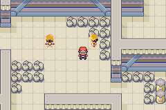
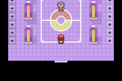
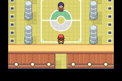

# Overworld palette stress test — 15 September 2026

**No new visible palette glitches were confirmed in this pass.** The tested main ROM already contains palette recovery and the Route 7 trainer removals. No ROM, save or game-source changes were made during this inspection.

## Coverage

- 130 distinct overworld checkpoints across eight maps: Routes 7, 9, 19, 20 and 23, Power Plant, Rocket League arena, Indigo League arena.
- Repeated directional movement at 11 starting locations, once with day and once with night selected. This covers the Ace pair and other Aces, Route 9's mixed trainer palettes, Power Plant Electricians/Scientists, swimmers/tubers, grass effects, and native crossings between Routes 19 and 20.
- The step-driven time cycle remained active during the broad sweep, so it could naturally change during walking. An additional water check resets the step counter and explicitly verifies nighttime entry, crossing and return.
- Six Rocket actor entry/exit sequences: each of the three arena sprite types twice (male Rocket, Ariana, Petrel). Native entry and exit scripts were used.
- All 12 Indigo pool opponent graphics entered and exited using the native intro and exit movement. This tests sprite replacement and palette reuse, not 12 battles.
- Actual Rocket Petrel and Indigo Bruno battles completed with wins through native battle scripts, AI and input. Return-to-arena screenshots and palette checks passed. These use the strong disposable campaign party and are graphical tests, not difficulty measurements.

## Results

The runtime log contains 470 active-object observations: 183 dynamic palette-tag passes and 287 fixed-slot observations, with no failed checkpoint checks. Fixed slots were visually reviewed; the tag checker does not independently certify their RGB colours. Screenshots were reviewed for the broader visual result.

The continuous monitor sampled 53,250 eligible field frames. One apparent exception was investigated: Youngster F on Route 7 can temporarily retain fallback slot 2 while re-entering the engine's offscreen loading margin. The engine's `invisible` flag does not mean a sprite is inside the actual 240×160 viewport; it permits a 16-pixel margin.

A targeted replay captured every affected frame and calculated the sprite's screen bounds. In all ten captured mismatch frames, the sprite's bottom remained between y=-15 and y=-7: entirely above the screen. It recovered before becoming visible. This is documented in `transient-bounds.tsv` and the `transient-*.png` captures, and is not evidence of a visible colour flash. No sustained on-screen capacity failure was found.

## Method and limits

The isolated Palette QA copy of installed mGBA used `/tmp/palette-stress/story.gba` and a disposable save. The user's main emulator session was not used. Test locations were reached through engine-script warps; movement and the Route 19/20 crossings used directional input. Trainer sight and random encounters were suppressed in test RAM. League graphics were exercised sequentially as they appear in play, not artificially displayed all at once. Runtime checks compare dynamic sprite assignments with expected palette tags; they do not prove correctness of every lighting calculation or animation.

The test does not cover every possible map, weather effect, reflection, story state or simultaneous NPC arrangement. Palette recovery still cannot create additional hardware slots if live demand genuinely exceeds capacity.

Evidence: `runtime-palettes.tsv`, `continuous.tsv`, `transient-bounds.tsv`, `battles.tsv`, `summary.json`, screenshots and `harness/`. The main ROM remained byte-for-byte identical to the tested copy, SHA-256 `a188e18407295d0095823f615d60a1ce174ef9b9b00dfb1829ed686de27d7106`. Protected main save and customisation ROM hashes were unchanged.
