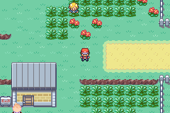

# Route 7 trainer removals and palette retest

Removed the Channeler and Scout F map objects from Route 7. The route retains its Youngsters, Trendsetters, Psychic and story actors. Named local IDs regenerate from the remaining 14 objects, and all nine named Route 7 story-object constants were checked against the new positions. Trainer-party definitions remain available to other maps.

The main ROM was rebuilt successfully. Champion compiled-moveset, Apex readiness and terminal checks passed; protected main save and customisation ROM hashes were unchanged.

## Live result

The removal does **not** completely resolve the palette problem. Eight checkpoints were captured across repeated north/south walks in both night and day lighting. The remaining Psychic (graphics 202, expected tag `0x1140`) still uses fallback slot 2 at all four southern checkpoints.

At spawn time, northern trainers can still hold the slot the Psychic needs. When those trainers despawn, the slot becomes free, but the existing Psychic sprite does not retry allocation. The southern steady-state requirement is now four dynamic palettes (Psychic, Trendsetter M, weather, grass), but transition timing and missing recovery still cause the failure. A subsequent allocator-recovery fix remains necessary.

Method: current rebuilt ROM with a disposable copy of the campaign save; native map-script warp to Route 7 (12,60), then normal movement to (12,70), north again and south again. Repeat with the other time-of-day setting. Trainer sight/random encounters disabled only in test RAM. Runtime palette evidence is in `runtime-palettes.tsv`.

ROM SHA-256: `49897dcf9de1b4c82dace5cfaf50af428a77c091c6be22aeeafedb4fd4802d00`.

Subsequent repair: [palette recovery](../palette-recovery/README.md) now passes the Route 7 day/night walking reproduction. Earlier failures above are historical.
