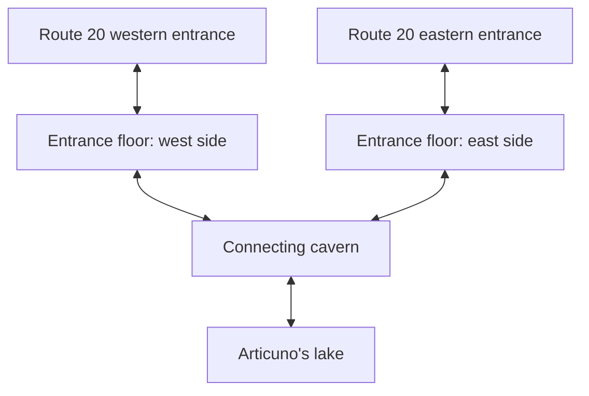

# Seafoam: three-floor exploration cave

Implemented September 14, 2026. Main ROM SHA-256: `93b6f86a1cd59d0e0b8b25ad233f048ba3ec40536849e839b59a64642e0e1804`.

## Playable route

The entrance floor reuses 1F, the connecting cavern reuses B2F, and the lake
reuses B4F. Their displayed floor numbers are 0, -1 and -2. Both Route 20 exits
remain. The two sides of the entrance floor join through the connecting cavern;
the descent to the lake is a separate branch.

Removed all Seafoam boulders, drop holes, surplus ladders and forced currents
from the playable route. The lake uses calm water and the Cascade Board. Route 20
now explains the connecting cavern and lake instead of sending the player to buy
Strength. The lake sign gives Board guidance.

The entrance witness and Ice Heal remain. The Water Stone and Revive from old
B1F now occupy side paths in the connecting cavern, alongside the Big Pearl.
Their original collection flags remain, avoiding duplicate rewards on old saves.
The lowest floor retains its Ultra Ball and hidden Water Stone.

B1F and B3F are no longer reachable from the map network. Their map IDs remain as
compatibility shells; entering either redirects to the western entrance. This
avoids renumbering other maps and gives older saves a way out. Current-stopped and
boulder flags no longer control the new route. Route 20's old reset scripts were
removed. Unused legacy layouts/flag definitions remain reserved compatibility data.

Articuno still requires three clues and retains its existing encounter outcome
rules. Its scripts and the C-side immediate reveal table now agree on the new
local object ID. The lake uses normal Surf transitions, including reloads while
on water, instead of the old falling-current landing behavior. The registered Cascade Board
now uses the standard item-use task, including stopping the player and clearing
movement before boarding, rather than bypassing that setup.

## Verification

- Built the main ROM successfully. Existing linker RWX-segment warning remains.
- Collision/elevation/directional checks verify both directions between the
  retained stairs, both entrances, and access beside all items and Articuno.
- Scanned active layouts for holes, currents and orphan ladders; none remain.
- All 846 fixed warp destinations resolve. Story text width checks pass.
- Live disposable-save traversal passed west → east and east → west through the
  middle floor. Strength was disabled and the prepared party has no Strength.
- Walked the middle-to-lake stairs, launched the Cascade Board through the Bag,
  crossed to Articuno, and returned through the same stairs.
- Saved while on the lake, reset the emulator and loaded the save: Surf state
  and movement were preserved.
- Diagnostic clue fixtures verified hidden-before-clues and current-map reveal
  after three clues. Explicitly interacted with Articuno and completed its battle.
- Native entries to both retired maps triggered their compatibility redirects.
- In the final ROM, Select launched the registered Board from Articuno’s shore;
  the return crossing/stairs passed. Both relocated items were picked up live.

This was a focused route test using an accelerated test party and diagnostic
warps/flags to establish starting conditions, not another full campaign run.
One early encounter-completion assertion followed a random wild battle rather
than Articuno; the failed probe is retained with its successful explicit-interaction
check. The initial registered-shortcut attempt exposed a launch bug. A cleanup-only
attempt did not solve it; routing the shortcut through the standard item action
did. The final launch, return traversal and relocated item pickups passed live.

Your main save and player-customisation ROM were not changed.

## Evidence

- [Route and data regression](verify.py)
- [Runtime checks](runtime-tests.tsv)
- [East exit](seafoam-004-route20-east-exit.png)
- [West exit](seafoam-009-route20-west-exit.png)
- [Lake save reloaded](seafoam-019-lake-save-reloaded.png)
- [Articuno reached](seafoam-020-articuno-reached.png)
- [Returned to middle cavern](seafoam-030-return-middle.png)

Additional evidence: [registered Board launch](seafoam-032-shortcut-standard-path.png),
[Water Stone pickup](seafoam-033-water-stone.png), [Revive pickup](seafoam-034-revive.png).
